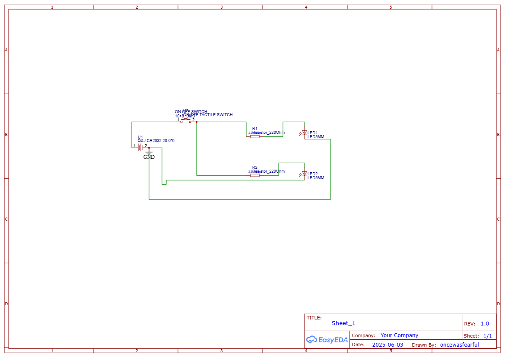
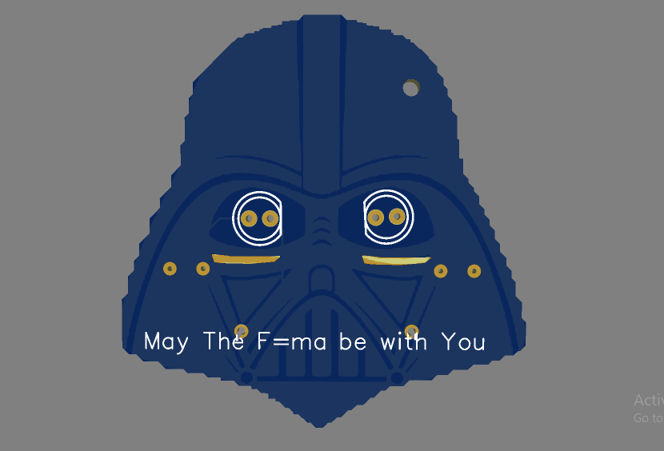
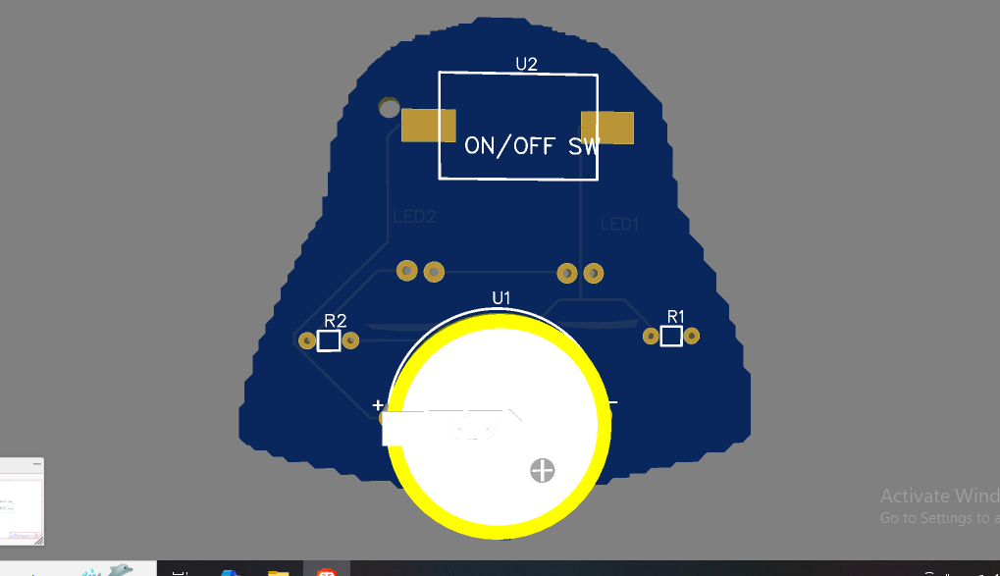

# Darth Vader Keychain PCB

## 🛠 Description
A custom Darth Vader-themed PCB keychain with LEDs for the eyes, designed as part of Hack Club’s Solder workshop. The project uses a simple LED + button circuit powered by a CR2032 battery.

## 🧾 Bill of Materials (BOM)
| Component         | Quantity | Notes                        |
|------------------|----------|------------------------------|
| 5mm Red LED       | 2        | Eyes of the helmet           |
| 220Ω Resistor     | 2        | Current limiting             |
| 8mm Push Button   | 1        | Turns LEDs on                |
| CR2032 Battery Holder | 1     | Powers the circuit           |
| CR2032 Coin Cell  | 1        | Power source                 |
| Custom PCB        | 1        | Darth Vader helmet shape     |

## 🖼 Screenshots
### Schematic

### PCB Layout

### 3D View
FRONT

BACK

## 🧑‍💻 Slack Username
**@Fearless**
