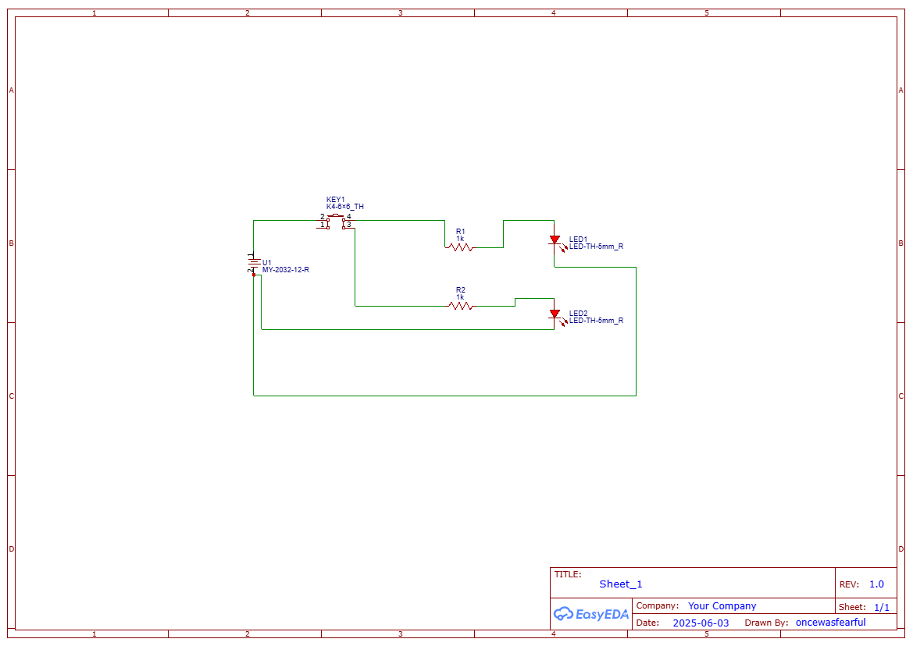
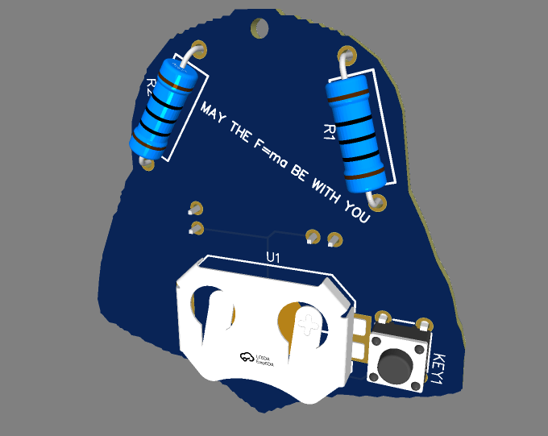

# Darth Vader Keychain PCB

## 🛠 Description
A custom Darth Vader-themed PCB keychain with LEDs for the eyes, designed as part of Hack Club’s Solder workshop. The project uses a simple LED + button circuit powered by a battery.

## 🧾(BOM)
| Component         | Quantity | Notes                        |
|------------------|----------|------------------------------|
| 5mm Red LED       | 2        | Eyes of the helmet           |
| 220Ω Resistor     | 2        | Current limiting             |
| Push Button   | 1        | Turns LEDs on                |
| Battery  | 1     | Powers the circuit           |

## 🖼 Screenshots
### Schematic

### PCB Layout

### 3D View
FRONT

BACK

## 🧑‍💻 Slack Username
<<<<<<< HEAD
**@Fearless**
=======
**@Fearless**--Display NAME
**@Saksham Kumar**

>>>>>>> 6082cb30f04882f1b1ed844a85c57ab0d386b863
